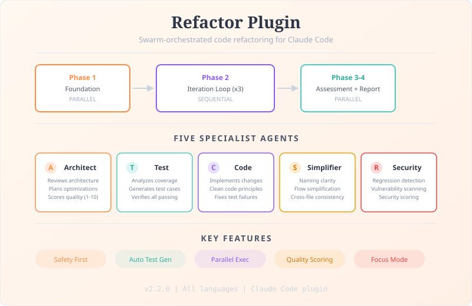

# Refactor Plugin


Swarm-orchestrated iterative code refactoring with specialized AI agents that ensure test coverage, design optimizations, simplify code, review security, and verify quality through parallel execution and multiple refinement cycles.

<picture>
  <source media="(prefers-color-scheme: dark)" srcset=".github/readme-infographic-dark.svg">
  <source media="(prefers-color-scheme: light)" srcset=".github/readme-infographic.svg">
  
</picture>

## Overview

The Refactor plugin orchestrates five specialized agents as a swarm team to systematically improve code quality while preserving functionality:

- **Architect Agent** — Reviews code architecture, plans optimizations, scores quality
- **Refactor-Test Agent** — Ensures comprehensive test coverage and validates changes
- **Refactor-Code Agent** — Implements clean code improvements safely
- **Simplifier Agent** — Simplifies changed code for clarity, consistency, and maintainability
- **Security-Review Agent** — Detects security regressions, scans for vulnerabilities, scores security posture

## How It Works

The refactoring process uses swarm orchestration (TeamCreate, TaskCreate/TaskUpdate, SendMessage) with parallel execution where possible:

```text
Phase 0: Initialize
├── Create swarm team
├── Spawn agents (all 5, or subset via --focus)
└── Create phase tasks

Phase 1: Foundation (PARALLEL)
├── [refactor-test]   → Analyze coverage, add missing tests, verify passing
├── [architect]       → Initial architecture review, identify all opportunities
└── [security-review] → Establish security baseline for regression detection

Phase 2: Iteration Loop (×3 default, ×1 in focus mode)
│
├── Step A: [architect]       → Create optimization plan (top 3 priorities)
├── Step B: [refactor-code]   → Implement top 3 optimizations
├── Step C: [refactor-test]   → Run full test suite, report pass/fail
├── Step D: [refactor-code]   → Fix test failures if any → [refactor-test] re-run
├── Step E: [simplifier]      → Simplify all code changed this iteration
│           [security-review] → Review changes against baseline (PARALLEL)
└── Step F: [refactor-test]   → Verify simplification + security fixes

Phase 3: Final Assessment (PARALLEL)
├── [simplifier]      → Final whole-scope simplification pass
├── [architect]       → Prepare final quality assessment framework
└── [security-review] → Final security assessment + Security Posture Score

Phase 4: Final Verification & Report
├── [refactor-test] → Final test suite run
├── [architect]     → Score code (Clean Code + Architecture + Security Posture)
├── Generate refactor-result-{timestamp}.md
└── Shutdown team
```

In focus mode (`--focus`), only the relevant agents spawn and irrelevant steps are skipped. The refactor-test and refactor-code agents always run as a safety net.

## Quick Start

```bash
# Refactor entire codebase
/refactor

# Refactor specific directory
/refactor src/utils/

# Refactor specific file
/refactor src/app.ts

# Refactor by description
/refactor "authentication logic"

# Override iteration count
/refactor --iterations=5 src/

# Security-only review (1 iteration default)
/refactor --focus=security src/auth/

# Architecture + security review
/refactor --focus=security,architecture src/

# Simplification pass only
/refactor --focus=simplification src/utils/
```

## Installation

### Prerequisites

- [Claude Code](https://github.com/anthropics/claude-code) CLI
- Git
- (Optional) [GitHub CLI](https://cli.github.com/) (`gh`) for PR and report publishing features

### Install

```bash
claude --plugin-dir /path/to/refactor
```

## Features

- **Safety First** — Only improves code quality, never alters behavior. Tests pass before and after every change.
- **Parallel Execution** — Phase 1 and Phase 3 run agents simultaneously for faster results.
- **Automatic Test Generation** — Adds missing test cases for critical paths, edge cases, and error handling.
- **Quality Scoring** — Clean Code, Architecture, Security Posture, and Simplification scores (1--10) with per-criteria justifications.
- **Code Simplification** — Post-implementation polish: naming clarity, guard clauses, redundancy removal, cross-file consistency.
- **Security Review** — Per-iteration regression detection, vulnerability scanning, secrets/PII checks, blocking on Critical/High findings.
- **Focus Mode** — Constrain runs to specific disciplines (`--focus=security`, `architecture`, `simplification`, `code`) with 1-iteration default.
- **Configurable Workflow** — Commit strategies, PR creation, and report publishing via `.claude/refactor.config.json`.

## Documentation

| Document | Quadrant | Description |
|----------|----------|-------------|
| [Tutorial: Your First Refactor](docs/tutorial.md) | Tutorial | Guided walkthrough from install to report review |
| [How to Configure Commit Strategies](docs/guides/configure-commits.md) | How-to | Set up commits, PRs, and report publishing |
| [How to Scope Refactoring](docs/guides/scope-refactoring.md) | How-to | Choose effective scopes for different project sizes |
| [How to Run Focused Refactoring](docs/guides/focus-refactoring.md) | How-to | Constrain runs to specific disciplines with --focus |
| [Troubleshooting](docs/guides/troubleshooting.md) | How-to | Diagnose and resolve common problems |
| [Configuration Reference](docs/reference/configuration.md) | Reference | Full config schema, fields, and examples |
| [Agent Reference](docs/reference/agents.md) | Reference | Agent specifications, tools, and invocation points |
| [Quality Score Reference](docs/reference/quality-scores.md) | Reference | Scoring rubrics and criteria |
| [Swarm Orchestration Design](docs/explanation/architecture.md) | Explanation | Why the plugin works this way |

## FAQ

**Q: Will this change my code's functionality?**
A: No. The refactoring process explicitly preserves all functionality. Only code quality and structure are improved.

**Q: What if my project has no tests?**
A: The test agent will create them. That's Phase 1.

**Q: What languages/frameworks are supported?**
A: All languages. Agents adapt to your project's testing framework and conventions.

**Q: Can I stop mid-refactor?**
A: Yes, but you'll lose progress. Better to start with smaller scope.

**Q: Why does --focus still spawn test and code agents?**
A: The refactor-test and refactor-code agents are a safety invariant. Tests must always pass, and the code agent must be available to fix failures or security findings.

**Q: Why does a focused run default to 1 iteration?**
A: Focused runs are typically quick targeted checks. Override with `--iterations=N` for iterative improvement.

## Changelog

See [CHANGELOG.md](CHANGELOG.md) for all versions.
